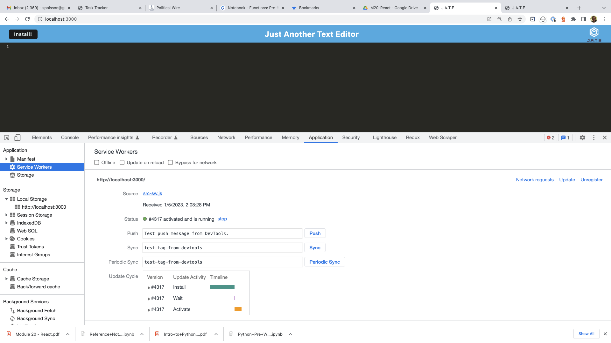
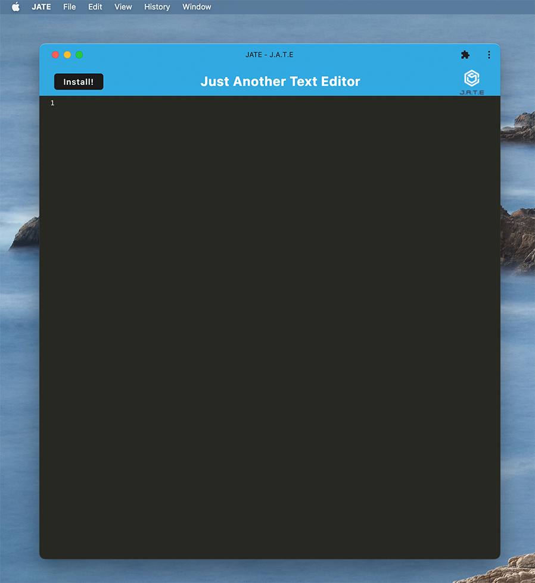

# Progressive_Web_Application_Text_Editor
Text editor that runs in the browser using an IndexedDB database

UCLA Bootcamp Challenge  - Module 19

Due Date 1/09/2023

## Challenge Tasks

Build a single page text editor that runs in the browser and meets PWA criteria. It will use idb package to store and retrieve data. The application will function offline and use webpack and service workers to serve as redundancy in case the app functions are not supported by the browser.

## Acceptance Criteria
- Create a client server folder structure that once 'npm run start' is run it starts up the backend and serves the client
- Bundle javascript files using webpack
- Run webpack plugins to generate HTML file, service worker, and a manifest file
- use next-gen JavaScript 
- Once the text editor is open IndexedDB immediately creates a database storage
- Enter content and click off the DOM window
- Content is saved and retrieved once the window is reopned
- Click install and download the application as an icon on my desktop
- The following image shows the installed Service Worker

- The installed application will look like 

## Heroku
Text Application is deployed on Heroky at [here](https://shrouded-tundra-05839.herokuapp.com/)

## GitHub 
ReRepository for Text Editor application can be found at: [GitHub](https://github.com/Me-ross/Progressive_Web_Application_Text_Editor)
